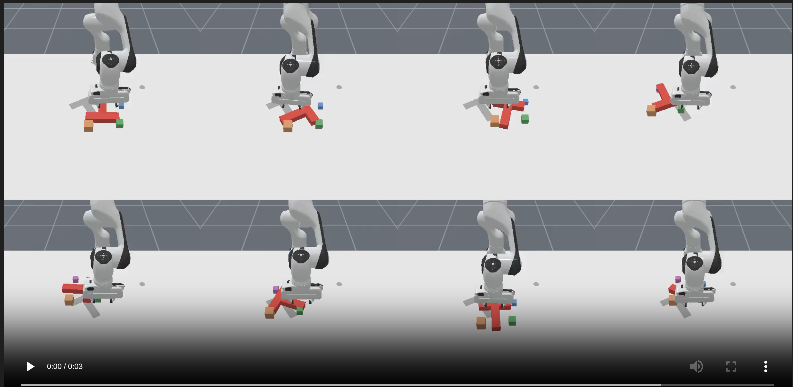

# POLARIS

POLARIS (Policy Assignment for Robust Intent-Driven Skill Execution) is a robot manipulation framework that combines LLM-based task decomposition with an adaptive skill library. Long-horizon tasks are broken into subgoals by an LLM, which compresses the simulation state into a PDDL representation of object states and constraints. For each subgoal, a **Policy Assignment** module selects the most efficient execution method — classical motion planning (RRT*) or a learned RL policy (PPO) — and retries with reassignment on failure.

## System Components

### Adaptive Task Decomposition
- An LLM breaks long-horizon tasks into a sequence of primitive subgoals
- The simulation state is compressed into a PDDL-style representation of object states and constraints, which is passed as context to the LLM

### Policy Assignment
- For each subgoal, evaluates **classical motion planning** (RRT*, Cartesian) vs **learned RL policies** (PPO) on efficiency and success rate
- On failure, reassigns the subgoal to an alternative method from the skill library
- The skill library is designed to grow — new classical or learned backends can be added per skill

### Skills Library
Each skill has multiple backends sharing the same environment, so methods are directly comparable:

| Skill | Classical | Learned (PPO) | Environment |
|---|---|---|---|
| Reach | RRT* (`reach_rrt.py`) | PPO (`reach_ppo.py`) | `MoveGoal-WithObstacles-v1` |
| Push Cube | RRT (`push_cube_rrt.py`) | PPO (`push_cube_ppo.py`) | `PushCube-WithObstacles-v1` |
| Pick | — | — | — |
| Place | — | — | — |
| Push T | — | — | `PushT-WithObstacles-v1` |

## Project Structure

```
POLARIS/
├── envs/                          # Custom ManiSkill environments (shared across methods)
│   ├── pusht_obstacles.py         # PushT, PushCube, MoveGoal with obstacle variants
│   ├── shelf_retrieve_v1.py       # Object retrieval from shelf
│   └── shelf_scene_builder.py
├── skills/                        # Skill backends
│   ├── push_cube/
│   │   ├── push_cube_ppo.py       # Learned: PPO policy
│   │   └── push_cube_rrt.py       # Classical: RRT planner
│   └── reach/
│       ├── reach_ppo.py           # Learned: PPO policy
│       └── reach_rrt.py           # Classical: RRT* in joint space
├── examples/                      # Demos and visualization
│   ├── push_cube_ppo_demo.py
│   ├── pusht_obstacles_demo.py
│   ├── reach_demo.py              # Proportional controller baseline
│   ├── reach_ppo_demo.py
│   └── reach_rrt_demo.py
├── high_level_planner/            # LLM-based subgoal generation
│   ├── llm_plan.py                # PDDL problem builder + LLM/symbolic/BFS planner
│   ├── env_subgoal_runner.py      # Live env or dummy state → subgoals
│   ├── domain_pusht.pddl          # PDDL domain (actions, predicates)
│   └── config.json.example        # Gemini API config template
├── planning_wrapper/              # State clone/restore utilities for planning backends
└── runs/                          # Training checkpoints (auto-created)
```

## Installation

### Step 1: Clone the Repository

```bash
git clone https://github.com/meganmlee/POLARIS.git
cd POLARIS
```

### Step 2: Create Conda Environment

```bash
conda create -n polaris python=3.11 -y
conda activate polaris
```

### Step 3: Install Pinocchio

```bash
conda install -c conda-forge pinocchio -y
```

### Step 4: Install Python Dependencies

```bash
pip install --upgrade pip
pip install -r requirements.txt
```

### Step 5: Install ManiSkill3

```bash
pip install git+https://github.com/haosulab/ManiSkill.git
```

### Step 6: Install PyTorch

```bash
# CUDA 11.8
pip install torch torchvision torchaudio --index-url https://download.pytorch.org/whl/cu118

# CUDA 12.1
pip install torch torchvision torchaudio --index-url https://download.pytorch.org/whl/cu121

# CPU only
pip install torch torchvision torchaudio
```

### Step 7: Install the Package

```bash
pip install -e .
```

### Verify

```bash
python -c "import mani_skill; print('ManiSkill3 OK')"
python -c "import envs; print('Custom envs OK')"
python -c "import torch; print('PyTorch', torch.__version__)"
```

## Environments

All environments are in [envs/](envs/) and registered on `import envs`. RL and planning backends for each skill use the **same environment** so performance is directly comparable.

| Environment ID | Base Task | Notes |
|---|---|---|
| `MoveGoal-WithObstacles-v1` | MoveToPoint | 4 randomized obstacle cubes |
| `PushCube-WithObstacles-v1` | PushCube | 4 randomized obstacle cubes |
| `PushT-WithObstacles-v1` | PushT | 4 randomized obstacle cubes |
| `ObjectRetrieveFromShelf-v1` | Custom | Cluttered shelf, randomized target |

## Training & Evaluation

### Learned Skills (PPO)

```bash
# Train
cd skills/<skill>
python reach_ppo.py
python push_cube_ppo.py

# With options
python push_cube_ppo.py \
    --num_envs 512 \
    --total_timesteps 10_000_000 \
    --seed 42

# Evaluate a checkpoint
python push_cube_ppo.py \
    --evaluate \
    --checkpoint runs/PushCube-WithObstacles-v1__1__<timestamp>/final_ckpt.pt
```


### Classical Skills

No training required.

```bash
python skills/reach/reach_rrt.py
python skills/reach/reach_rrt.py --num_episodes 20 --seed 42
python skills/push_cube/push_cube_rrt.py
```

## Running Demos

```bash
# Reach
python examples/reach_demo.py        # proportional controller baseline
python examples/reach_ppo_demo.py --checkpoint runs/<run>/final_ckpt.pt  # PPO policy
python examples/reach_rrt_demo.py    # RRT* planner
python examples/reach_ppo_demo.py --checkpoint runs/<run>/final_ckpt.pt --seed 10 # change seed randomization (default 5)

# PushCube
python examples/push_cube_ppo_demo.py
python examples/push_cube_ppo_demo.py --checkpoint runs/<run>/final_ckpt.pt

# PushT
python examples/pusht_obstacles_demo.py
```

## Planning Wrapper

Planning backends (RRT, etc.) require branching and backtracking without a full simulator reset. The `planning_wrapper` package provides state cloning and restoration for any ManiSkill3 environment.

```python
from planning_wrapper import ManiSkillPlanningWrapper
from planning_wrapper.adapters import PushTTaskAdapter
import gymnasium as gym
import envs

env = gym.make("PushT-WithObstacles-v1", obs_mode="state_dict", control_mode="pd_ee_delta_pose")
wrapper = ManiSkillPlanningWrapper(env, adapter=PushTTaskAdapter())

obs, info = wrapper.reset(seed=0)
snapshot = wrapper.clone_state()   # save branch point
# ... planner searches ...
wrapper.restore_state(snapshot)    # backtrack
```

Available adapters: `PushTTaskAdapter`, `ShelfRetrieveTaskAdapter`.


## Subgoal generation running

## 1. `high_level_planner/llm_plan.py` (The Planner)

This file is the **brain**.

It takes a simple input:
- Where the object (tee) is
- Where the goal is
- Where the robot hand is
- Where obstacles are

Then it:

### Step 1: Converts everything into a grid
- Breaks the table into small boxes (like graph paper)
- Figures out which box everything is in

### Step 2: Tries to make a plan (subgoals)

It tries **3 methods (in order):**

1. **Gemini (AI model)**
   - Asks AI: "What steps should I take?"
   - AI gives a list like:
     - move here
     - push object
     - etc.

2. **If AI fails → use pyperplan (symbolic planner)**
   - This is a strict rule-based planner
   - It computes a valid step-by-step plan

3. **If that also fails → use BFS**
   - Very basic search
   - Just finds *some* way to reach goal

### Step 3: Fix the plan
- If both AI and planner exist:
  - It adjusts AI steps to make them logically correct

### Output:
A list like:

reach (robot-at r_5_5)
push_tee (object-at r_4_5)


---

## 2. `high_level_planner/env_subgoal_runner.py` (The Runner)

This file is the **input builder + executor**.

### Two modes:

#### (A) `--live` (real simulator)
- Runs a robot simulation (ManiSkill)
- Reads:
  - object position
  - goal position
  - robot hand position
  - obstacles

#### (B) No flag (default)
- Uses fake/dummy data
- No simulator needed

### What it does:
1. Gets the current state
2. Sends it to the planner (`llm_plan.py`)
3. Prints the subgoals

---

## 3. `high_level_planner/domain_pusht.pddl` (Rules File)

This file defines the **rules of the world**.

### It tells:
- What things exist:
  - robot, object, blocks, grid cells

- What is true/false:
  - robot-at
  - object-at
  - clear space

- What actions are allowed:
  - reach → move robot hand
  - push_tee → push object
  - pick → pick object
  - place → place object
  - push_cube → move obstacle

Think of it like:
> "What moves are legal in this game?"

---

## 4. `high_level_planner/config.json.example` (Settings Template)

This is just a **template file**.

Used for:
- Connecting to Gemini (Google AI)

You need to fill:
- project ID
- location

OR set them as environment variables

---

# Setup (Very Simple)

From project folder:

### Install Gemini support if not already:

pip install google-cloud-aiplatform


### Install ManiSkill (if not already)
- Needed for simulation

### Set config (one of these):

#### Option 1 (env vars):

export VERTEX_PROJECT=your_project
export VERTEX_LOCATION=us-central1


#### Option 2 (file):
- Copy config.json.example → config.json
- Fill values

---

# How to Run

## 1. Simple test (no AI, no planner)

python high_level_planner/llm_plan.py --offline

- Uses only BFS
- Good for debugging

---

## 2. Normal run (AI + fallback planner)

python high_level_planner/llm_plan.py


---

## 3. Run with simulator

python high_level_planner/llm_plan.py --live


---

## 4. Only AI (skip planner)

python high_level_planner/llm_plan.py --live --llm


---

## 5. Force planner first

SUBGOAL_PDDL_FIRST=1 python high_level_planner/llm_plan.py --live


---

# What Output Looks Like

You will see steps like:

reach (robot-at r_5_5)
push_tee (object-at r_4_5)
push_tee (object-at goal)


Meaning:
- move robot
- push object
- reach goal

---

## Requirements

- Python 3.11
- ManiSkill3
- PyTorch (GPU recommended for PPO training)
- Pinocchio (via conda)

See [requirements.txt](requirements.txt) for the full dependency list.


## Contributors
Megan Lee
Tom Gao
Abhishek Mathur